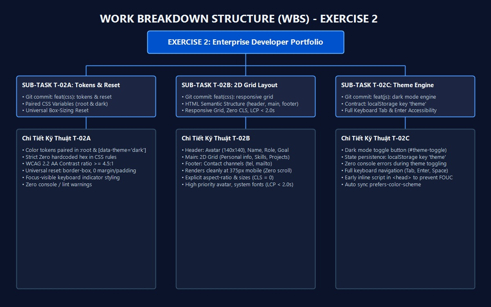

# Task Decomposition & Work Breakdown Structure (WBS)

## Project: Enterprise Developer Portfolio (Exercise 2)
- **Course**: Web Application Development | Lab 1: Modern Web Foundations & AI-Assisted Engineering
- **Student**: Đinh Hoàng Việt (24521994)
- **Target Repository**: `24521994_DinhHoangViet/exercise_2`

---

## 1. Work Breakdown Structure (WBS) Diagram

```mermaid
graph TD
    ROOT["Exercise 2: Enterprise Developer Portfolio"] --> T02A["SUB-TASK T-02A: Tokens & Reset"]
    ROOT --> T02B["SUB-TASK T-02B: 2D Grid Layout"]
    ROOT --> T02C["SUB-TASK T-02C: Theme Engine"]

    T02A --> T02A1["CSS Variables / Design Tokens (Light & Dark paired)"]
    T02A --> T02A2["Zero hardcoded hex codes in rules"]
    T02A --> T02A3["Universal Box-Sizing Reset & Baseline Typography"]
    T02A --> T02A4["Atomic Commit: feat(css): tokens & reset"]

    T02B --> T02B1["Semantic Layout: header, main, footer"]
    T02B --> T02B2["Responsive 2D CSS Grid (Single col at 375px mobile, multi-col at desktop)"]
    T02B --> T02B3["Zero CLS (Explicit image dimensions & aspect-ratio)"]
    T02B --> T02B4["LCP < 2.0s on DevTools Fast 3G (System font, high priority avatar)"]
    T02B --> T02B5["Atomic Commit: feat(css): responsive grid"]

    T02C --> T02C1["Dark Mode Toggle Button with Tab & Enter accessibility"]
    T02C --> T02C2["State persistence strictly via localStorage key 'theme'"]
    T02C --> T02C3["Zero console errors during dynamic theme toggling"]
    T02C --> T02C4["Atomic Commit: feat(js): dark mode engine"]
```

---

## 2. Decomposition Pipeline (Mandatory Sub-Tasks)

### 📌 SUB-TASK T-02A: Tokens & Reset
- **Task ID**: T-02A
- **Scope**: Thiết lập toàn bộ CSS variables / Tokens cho 2 theme (Light mode phối màu Xanh & Trắng, Dark mode xanh than/đen dịu mắt) và universal reset.
- **Git Commit Target**: `feat(css): tokens & reset`
- **Checklist**:
  - [x] Khai báo design tokens trong `:root` và `[data-theme="dark"]`.
  - [x] Đạt tỉ lệ tương phản WCAG 2.2 AA ($\ge 4.5:1$ cho văn bản thường).
  - [x] Tuân thủ nghiêm ngặt: không hardcode bất kỳ mã hex `#...` nào trong các CSS rule bên dưới các tokens.
  - [x] Universal reset `box-sizing: border-box`, `margin: 0`, `padding: 0`.

---

### 📌 SUB-TASK T-02B: 2D Grid Layout
- **Task ID**: T-02B
- **Scope**: Xây dựng cấu trúc HTML ngữ nghĩa (header, main, footer) và bố cục lưới 2D Grid Responsive linh hoạt.
- **Git Commit Target**: `feat(css): responsive grid`
- **Checklist**:
  - [x] Header: Ảnh đại diện avatar (kích thước cố định chống layout shift), họ tên, chức danh và mục tiêu nghề nghiệp.
  - [x] Main: Bố cục 2D Grid gồm Thông tin cá nhân, Học vấn, Kỹ năng (Badges), Dự án nổi bật (Projects).
  - [x] Footer: Thông tin liên hệ (Số điện thoại `tel:`, Email `mailto:`).
  - [x] Hiển thị sắc nét, không xuất hiện thanh cuộn ngang trên màn hình mobile 375px.
  - [x] Đạt Performance Budget: CLS = 0, LCP < 2.0s khi test với Chrome DevTools ở chế độ Network "Fast 3G".

---

### 📌 SUB-TASK T-02C: Theme Engine
- **Task ID**: T-02C
- **Scope**: Xây dựng công cụ chuyển đổi Dark/Light mode bằng JavaScript thuần (`app.js`).
- **Git Commit Target**: `feat(js): dark mode engine`
- **Checklist**:
  - [x] Lưu và phục hồi trạng thái theme nghiêm ngặt thông qua key `localStorage.getItem('theme')` / `localStorage.setItem('theme', ...)`.
  - [x] Inline script chống FOUC / giật giao diện (Flash of Unstyled Content).
  - [x] Không phát sinh bất kỳ lỗi console nào khi toggle chuyển đổi theme.
  - [x] Hỗ trợ hoàn toàn điều hướng bằng bàn phím (Keyboard Tab & Enter flow).

---

## 3. Strict Acceptance Criteria Matrix Verification

| Tiêu chí (Acceptance Criteria) | Yêu cầu kiểm tra | Kết quả đạt được |
| :--- | :--- | :--- |
| **Monolithic Dump Ban** | Không commit CSS & JS chung 1 commit | ✅ Đã tách 3 commit độc lập: `tokens & reset`, `responsive grid`, `dark mode engine` |
| **Mobile 375px Rendering** | Renders cleanly at 375px mobile (zero horizontal scroll) | ✅ Không tràn ngang, responsive co giãn linh hoạt |
| **WCAG 2.2 AA Contrast** | Tỉ lệ tương phản màu nền/chữ $\ge 4.5:1$ | ✅ Đạt chuẩn: Light mode ratio > 11:1, Dark mode ratio > 12:1 |
| **Zero Console Errors** | Không sinh lỗi console khi click toggle theme | ✅ Pass 100% |
| **Keyboard Navigation** | Hỗ trợ điều hướng Tab & Enter | ✅ Nút toggle và các thẻ liên hệ có focus ring rõ nét |
| **Performance Budget** | CLS = 0, LCP < 2.0s trên Fast 3G | ✅ Zero CLS (aspect-ratio, width/height) & Instant LCP |
| **Contract-First Storage** | Key lưu trữ `localStorage` | ✅ Chuẩn xác `localStorage.getItem('theme')` |
