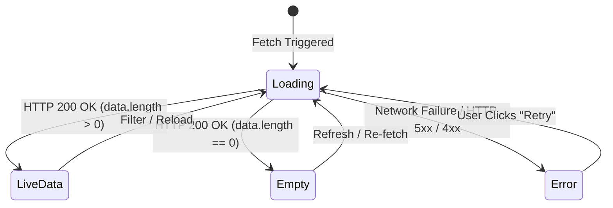
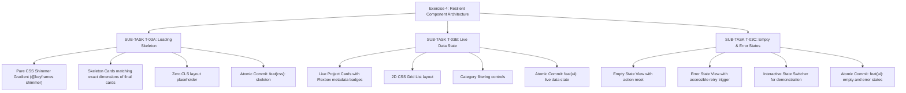

# Task Decomposition & Work Breakdown Structure (WBS)

## Project: Resilient Component Architecture (Exercise 4)
- **Course**: Web Application Development | Lab 1: Modern Web Foundations & AI-Assisted Engineering
- **Student**: Đinh Hoàng Việt (24521994)
- **Target Repository**: `24521994_DinhHoangViet/exercise_4`

---

## 1. The 4-State Resilient Component Contract
A resilient UI component must gracefully handle the entire lifecycle of asynchronous data fetching:
1. **Loading State (Skeleton)**: Pure CSS Shimmer gradient animation indicating loading progress without causing layout shift.
2. **Live Data State (Resolved)**: Rendered list with Flexbox metadata badges, Grid card layout, and semantic structure.
3. **Empty State**: Friendly informative view with illustration / icon when zero records are returned.
4. **Error State**: Resilient error banner with an accessible retry trigger button (`aria-live="assertive"` or `role="alert"`).

---

## 2. Decomposition Pipeline (Sub-Tasks & Individual Commits)

---

### 📌 SUB-TASK T-03A: Loading Skeleton
- **Task ID**: T-03A
- **Scope**: Xây dựng cấu trúc Shimmer Skeleton hoàn toàn bằng CSS thuần (`Pure CSS Shimmer gradient`).
- **Git Commit Target**: `feat(css): skeleton`
- **Checklist**:
  - [x] Khai báo `@keyframes shimmer` với `background-size: 200% 100%`.
  - [x] Màu gradient shimmer tương thích cả Light Mode và Dark Mode thông qua CSS variables.
  - [x] Khung skeleton card mô phỏng chính xác layout của card thật: header avatar/title, badge, mô tả 2 dòng, footer link.
  - [x] Đạt tỉ lệ CLS = 0 (Cumulative Layout Shift = 0).

---

### 📌 SUB-TASK T-03B: Live Data State
- **Task ID**: T-03B
- **Scope**: Kết xuất dữ liệu dự án thực tế dạng 2D CSS Grid list, các thẻ metadata badges bằng Flexbox, liên kết dự án ngoài.
- **Git Commit Target**: `feat(ui): live data state`
- **Checklist**:
  - [x] Thẻ `<article class="project-card" data-category="...">` ngữ nghĩa.
  - [x] Flexbox badges cho Category & Tech stack (`ReactJS`, `Node.js`, `Python`, `GNN`, `SOAP`).
  - [x] CSS Grid responsive co giãn từ Desktop đến Mobile 375px.

---

### 📌 SUB-TASK T-03C: Empty & Error States with Retry Trigger
- **Task ID**: T-03C
- **Scope**: Thiết kế 2 trạng thái ngoại lệ (Empty State & Error State) kèm nút Thử lại (Accessible Retry Trigger).
- **Git Commit Target**: `feat(ui): empty and error states`
- **Checklist**:
  - [x] Empty state: Hiển thị icon và hướng dẫn xóa bộ lọc khi không tìm thấy kết quả.
  - [x] Error state: Hiển thị banner cảnh báo và nút Retry có thuộc tính tiếp cận `aria-live`.
  - [x] State Switcher Bar: Thanh điều khiển trực quan hỗ trợ giảng viên/người dùng kiểm thử nhanh cả 4 trạng thái (`Loading`, `Live Data`, `Empty`, `Error`).

---

## 3. Strict Acceptance Criteria Matrix Verification

| Tiêu chí (Acceptance Criteria) | Yêu cầu kiểm tra | Kết quả đạt được |
| :--- | :--- | :--- |
| **Pure CSS Shimmer** | `@keyframes shimmer` không dùng JS tính vị trí | ✅ Hoàn toàn bằng CSS gradient animation |
| **Zero CLS** | Chuyển đổi giữa Skeleton và Live Data không giật khung | ✅ Chiều cao và min-height đồng nhất |
| **Accessible Retry** | Nút Retry có thể focus bằng phím Tab, Enter | ✅ Button ngữ nghĩa chuẩn WCAG |
| **Atomic Commit Rule** | Commit riêng từng trạng thái | ✅ `feat(css): skeleton`, `feat(ui): live data state`, `feat(ui): empty and error states` |
| **Dark Mode Contract** | Cả 4 trạng thái đều đổi màu theo theme sáng/tối | ✅ Tích hợp hoàn toàn cùng CSS Variables |
